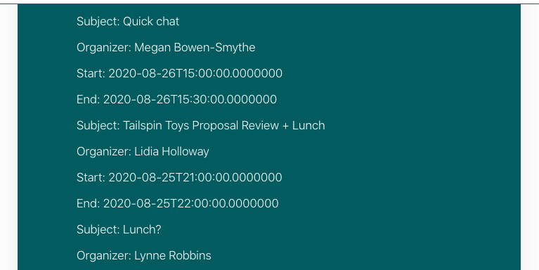

<!-- markdownlint-disable MD002 MD041 -->

<span data-ttu-id="94575-101">SharePoint 框架提供了对 Microsoft Graph 进行调用的 [MSGraphClient](https://docs.microsoft.com/javascript/api/sp-http/msgraphclient?view=sp-typescript-latest) 。</span><span class="sxs-lookup"><span data-stu-id="94575-101">The SharePoint Framework provides the [MSGraphClient](https://docs.microsoft.com/javascript/api/sp-http/msgraphclient?view=sp-typescript-latest) for making calls to Microsoft Graph.</span></span> <span data-ttu-id="94575-102">此类将包装 [Microsoft Graph JavaScript 客户端库](https://github.com/microsoftgraph/msgraph-sdk-javascript)，并使用当前登录用户对其进行预身份验证。</span><span class="sxs-lookup"><span data-stu-id="94575-102">This class wraps the [Microsoft Graph JavaScript Client Library](https://github.com/microsoftgraph/msgraph-sdk-javascript), pre-authenticating it with the current logged on user.</span></span>

<span data-ttu-id="94575-103">由于它包装现有的 JavaScript 库，因此其用法相同，并且与 Microsoft Graph TypeScript 定义完全兼容。</span><span class="sxs-lookup"><span data-stu-id="94575-103">Because it wraps the existing JavaScript library, its usage is the same, and it's fully compatible with the Microsoft Graph TypeScript definitions.</span></span>

## <a name="get-the-users-calendar"></a><span data-ttu-id="94575-104">获取用户的日历</span><span class="sxs-lookup"><span data-stu-id="94575-104">Get the user's calendar</span></span>

1. <span data-ttu-id="94575-105">打开 **/src/webparts/graphTutorial/GraphTutorialWebPart.ts** ，并 `import` 在文件顶部添加以下语句。</span><span class="sxs-lookup"><span data-stu-id="94575-105">Open **./src/webparts/graphTutorial/GraphTutorialWebPart.ts** and add the following `import` statements at the top of the file.</span></span>

    ```typescript
    import { MSGraphClient } from '@microsoft/sp-http';
    import * as MicrosoftGraph from '@microsoft/microsoft-graph-types';
    import { startOfWeek, endOfWeek, setDay, set } from 'date-fns';
    ```

1. <span data-ttu-id="94575-106">将以下函数添加到 **GraphTutorialWebPart** 类以呈现错误。</span><span class="sxs-lookup"><span data-stu-id="94575-106">Add the following function to the **GraphTutorialWebPart** class to render an error.</span></span>

    :::code language="typescript" source="../demo/graph-tutorial/src/webparts/graphTutorial/GraphTutorialWebPart.ts" id="renderGraphErrorSnippet":::

1. <span data-ttu-id="94575-107">添加以下函数以打印用户日历中的事件。</span><span class="sxs-lookup"><span data-stu-id="94575-107">Add the following function to print out the events in the user's calendar.</span></span>

    ```typescript
    private renderCalendarView(events: MicrosoftGraph.Event[]) : void {
      const viewContainer = this.domElement.querySelector('#calendarView');
      let html = '';

      // Temporary: print events as a list
      for(const event of events) {
        html += `
          <p class="${ styles.description }">Subject: ${event.subject}</p>
          <p class="${ styles.description }">Organizer: ${event.organizer.emailAddress.name}</p>
          <p class="${ styles.description }">Start: ${event.start.dateTime}</p>
          <p class="${ styles.description }">End: ${event.end.dateTime}</p>
          `;
      }

      viewContainer.innerHTML = html;
    }
    ```

1. <span data-ttu-id="94575-108">将现有的 `render` 函数替换为以下内容。</span><span class="sxs-lookup"><span data-stu-id="94575-108">Replace the existing `render` function with the following.</span></span>

    :::code language="typescript" source="../demo/graph-tutorial/src/webparts/graphTutorial/GraphTutorialWebPart.ts" id="renderSnippet":::

    <span data-ttu-id="94575-109">请注意此代码执行的操作。</span><span class="sxs-lookup"><span data-stu-id="94575-109">Notice what this code does.</span></span>

    - <span data-ttu-id="94575-110">它用于 `this.context.msGraphClientFactory.getClient` 获取经过身份验证的 **MSGraphClient** 对象。</span><span class="sxs-lookup"><span data-stu-id="94575-110">It uses `this.context.msGraphClientFactory.getClient` to get an authenticated **MSGraphClient** object.</span></span>
    - <span data-ttu-id="94575-111">它调用 `/me/calendarView` 终结点，并将 `startDateTime` 和 `endDateTime` 查询参数设置为当前星期的开始和结束。</span><span class="sxs-lookup"><span data-stu-id="94575-111">It calls the `/me/calendarView` endpoint, setting the `startDateTime` and `endDateTime` query parameters to the start and end of the current week.</span></span>
    - <span data-ttu-id="94575-112">它用 `select` 来限制返回的字段，只请求应用程序使用的字段。</span><span class="sxs-lookup"><span data-stu-id="94575-112">It uses `select` to limit which fields are returned, requesting only the fields the app uses.</span></span>
    - <span data-ttu-id="94575-113">它用于 `orderby` 按事件的开始时间对事件进行排序。</span><span class="sxs-lookup"><span data-stu-id="94575-113">It uses `orderby` to sort the events by their start time.</span></span>
    - <span data-ttu-id="94575-114">它用于将 `top` 结果限制为25个事件。</span><span class="sxs-lookup"><span data-stu-id="94575-114">It uses `top` to limit the results to 25 events.</span></span>

## <a name="deploy-the-web-part"></a><span data-ttu-id="94575-115">部署 web 部件</span><span class="sxs-lookup"><span data-stu-id="94575-115">Deploy the web part</span></span>

1. <span data-ttu-id="94575-116">在 CLI 中运行以下两个命令以生成和打包 web 部件。</span><span class="sxs-lookup"><span data-stu-id="94575-116">Run the following two commands in your CLI to build and package your web part.</span></span>

    ```Shell
    gulp bundle --ship
    gulp package-solution --ship
    ```

1. <span data-ttu-id="94575-117">打开浏览器并转到租户的 SharePoint 应用程序目录。</span><span class="sxs-lookup"><span data-stu-id="94575-117">Open your browser and go to your tenant's SharePoint App Catalog.</span></span> <span data-ttu-id="94575-118">选择左侧的 " **SharePoint 相关应用程序** " 菜单项。</span><span class="sxs-lookup"><span data-stu-id="94575-118">Select the **Apps for SharePoint** menu item on the left-hand side.</span></span>

1. <span data-ttu-id="94575-119">上载 **/sharepoint/solution/graph-tutorial.sppkg** 文件。</span><span class="sxs-lookup"><span data-stu-id="94575-119">Upload the **./sharepoint/solution/graph-tutorial.sppkg** file.</span></span>

1. <span data-ttu-id="94575-120">在 " **是否信任 ...** " 提示符处，确认该提示是否列出了您在 " **在package-solution.js打开** " 文件中设置的4个 Microsoft Graph 权限。</span><span class="sxs-lookup"><span data-stu-id="94575-120">In the **Do you trust...** prompt, confirm that the prompt lists the 4 Microsoft Graph permissions you set in the **package-solution.json** file.</span></span> <span data-ttu-id="94575-121">选择 **"使此解决方案可用于组织中的所有站点** "，然后选择 " **部署** "。</span><span class="sxs-lookup"><span data-stu-id="94575-121">Select **Make this solution available to all sites in the organization** , then select **Deploy**.</span></span>

1. <span data-ttu-id="94575-122">如果尚未为 web 部件审批关系图权限，请立即执行此操作。</span><span class="sxs-lookup"><span data-stu-id="94575-122">If you have not already approved the Graph permissions for your web part, do that now.</span></span>

    1. <span data-ttu-id="94575-123">使用租户管理员转到 [SharePoint 管理中心](https://admin.microsoft.com/sharepoint?page=classicfeatures&modern=true) 。</span><span class="sxs-lookup"><span data-stu-id="94575-123">Go to the [SharePoint admin center](https://admin.microsoft.com/sharepoint?page=classicfeatures&modern=true) using a tenant administrator.</span></span>

    1. <span data-ttu-id="94575-124">在左侧菜单中，依次选择 " **高级** "、" **API 访问** "。</span><span class="sxs-lookup"><span data-stu-id="94575-124">In the left-hand menu, select **Advanced** , then **API access**.</span></span>

    1. <span data-ttu-id="94575-125">从 **图-教程-客户端解决方案** 包中选择每个挂起的请求，然后选择 " **批准** "。</span><span class="sxs-lookup"><span data-stu-id="94575-125">Select each of the pending requests from the **graph-tutorial-client-side-solution** package and choose **Approve**.</span></span>

        

## <a name="test-the-web-part"></a><span data-ttu-id="94575-127">测试 web 部件</span><span class="sxs-lookup"><span data-stu-id="94575-127">Test the web part</span></span>

1. <span data-ttu-id="94575-128">转到要在其中测试 web 部件的 SharePoint 网站。</span><span class="sxs-lookup"><span data-stu-id="94575-128">Go to a SharePoint site where you want to test the web part.</span></span> <span data-ttu-id="94575-129">创建要在上测试 web 部件的新页面。</span><span class="sxs-lookup"><span data-stu-id="94575-129">Create a new page to test the web part on.</span></span>

1. <span data-ttu-id="94575-130">使用 web 部件选取器查找 **GraphTutorial** web 部件，并将其添加到页面中。</span><span class="sxs-lookup"><span data-stu-id="94575-130">Use the web part picker to find the **GraphTutorial** web part and add it to the page.</span></span>

    

1. <span data-ttu-id="94575-132">将在 web 部件中打印当前周的事件列表。</span><span class="sxs-lookup"><span data-stu-id="94575-132">A list of events for the current week are printed in the web part.</span></span>

    
